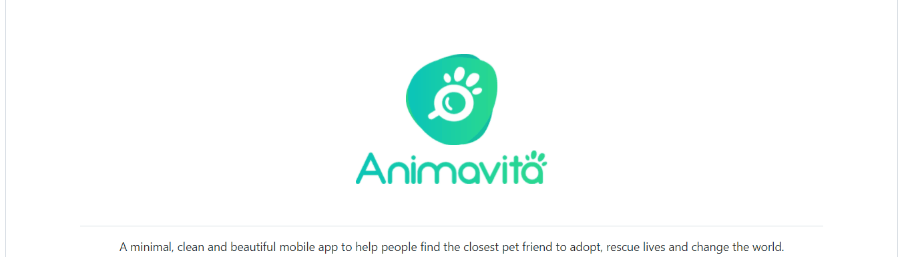

# Exemplo de Readme
Apenas um repositório para relembrar o básico
[](https://github.com/anuraghazra/github-readme-stats/blob/master/readme.md)

## Tecnologias usadas
- Markdown

## Como utilizar

1- Clocar o projeto
```
git glone nome do repositório
```
2- Acessar a pasta 
```
cd nome do repositório
```
3- Abra o vscode
```
code .
```